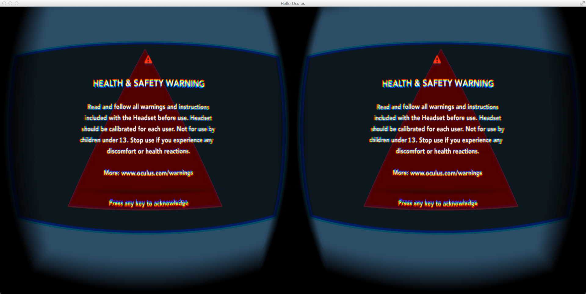

A hello world program for Oculus Rift DK2 development on Mac OS X.

Dependencies:

	* GLFW
	* GLEW
	* OpenGL 4.0+ compatible graphics card
	* Oculus Rift DK2
	* Mac OS X 10.9.4 (tested)

Functionalities:

	* Initialize libOVR
	* Initialize OpenGL 4.0 buffers, shaders, etc
	* Load a red triangle
	* HMD pose tracking
	* Keyboard input support for A-S-D-W view update

If you find it helpful, please feel free to let me know at wang.yu@umbc.edu.
